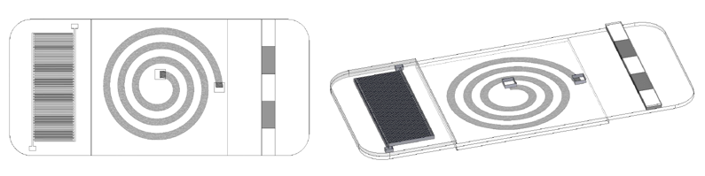
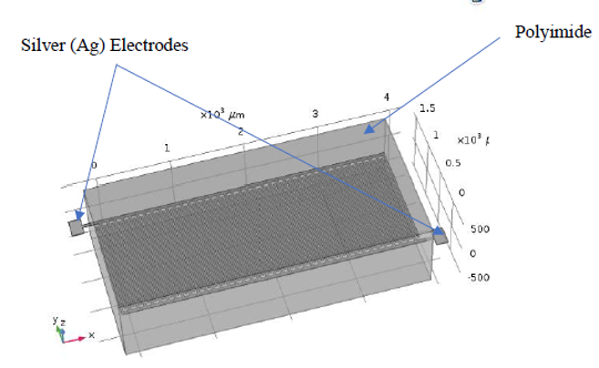
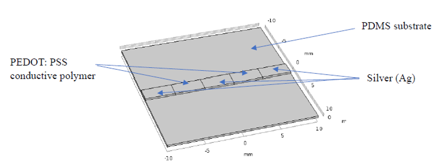

# 🌿 Design of a Plant Wearable Device for Assessing Microclimate’s Impact on Plant Growth

  

## 🌿 Overview

This project presents a **flexible plant-wearable multi-sensory platform** designed to monitor the **microclimate around individual leaves** and **quantify plant growth** without harming the plant.  
The device integrates **capacitive humidity**, **resistive temperature**, and **strain sensing** elements on a thin, lightweight, and conformal substrate, enabling localized monitoring of:

- Leaf-surface temperature  
- Ambient relative humidity  
- Leaf area expansion (as a proxy for growth)

---

## 🌱 Application Domain

The plant-wearable sensor is intended for **precision agriculture** and **plant science experiments**, where understanding microclimatic influence on growth is critical.

It can be used to:

- Study **microclimate–growth relationships** at the leaf level  
- Evaluate plant response under **different temperature and humidity conditions**  
- Provide continuous, non-destructive measurements for **phenotyping and research**  
- Support the design of **climate-optimized cultivation strategies**

---

## 🧠 Key Modules and Analysis

---

### 💧 Humidity Sensor – Comb-Structured Capacitive Design

- **Sensing principle:** Change in **capacitance** due to the variation of the **dielectric constant** of a polyimide film with absorbed moisture.  
- **Structure:** **Interdigitated comb electrodes** (80 finger-like structures) to increase effective sensing area and sensitivity.  
- **Materials:**
  - **Silver (Ag)** interdigitated electrodes  
  - **Polyimide** as the moisture-sensitive dielectric layer  
- **Modeling & Analysis:**
  - Electrostatic simulation using **COMSOL Multiphysics**  
  - Parametric sweep of **0–100 %RH** to obtain capacitance–humidity characteristics  
  - Achieved an approximately **linear sensitivity** of the capacitance with respect to RH.

  

---

### 🌡 Temperature Sensor – PEDOT:PSS-Based RTD

- **Sensing principle:** **Resistance Temperature Detector (RTD)** behavior of **PEDOT:PSS** where resistance decreases with increasing temperature.  
- **Structure:**
  - Thin **PEDOT:PSS** strip patterned between silver electrodes  
  - Optimized geometry to enhance sensitivity within **15–35 °C**, a typical plant growth range  
  - Electrical simulation using COMSOL with defined PEDOT:PSS material properties  

  

---

### 🌿 Strain Sensor – Leaf Growth Monitoring

- **Objective:** Measure **leaf area expansion** by detecting in-plane strain on the leaf surface.  
- **Sensing material:** **Silver nanowire (AgNW)–PDMS nanocomposite** acting as a piezoresistive element.  
- **Geometry:**
  - Spiral / curved sensing path to enable **multi-directional strain detection**  
  - Coupled **solid mechanics** and **electric current** simulations  
  - Application of edge loads to emulate leaf expansion  
  - Simulation results of **resistance variation** with the same load applied.

  

---

### 🧪 Simulation & Design Optimization

Across all three sensors:

- **3D CAD models** created and imported into **COMSOL Multiphysics**.  
- Dedicated physics interfaces:
  - **Electrostatics** for humidity sensor  
  - **Electric Currents** for temperature and strain sensors  
  - **Solid Mechanics** for mechanical response of the strain sensor  
- Performed:
  - Parametric sweeps (humidity, temperature, and load)  
  - Optimization of **geometry and material parameters** to improve sensitivity and linearity.  

## 🛠 Tools & Technologies

- `SOLIDWORKS` for 2D drawings and 3D sensor/platform modeling  
- `COMSOL Multiphysics` for coupled **electrical–mechanical simulations**  
- `PDMS`, `Ag Nanowires`, `Polyimide`, `PEDOT:PSS` as core materials for flexible sensing  
- Microfabrication concepts:
  - Photolithography  
  - Thin-film deposition  
  - Reactive Ion Etching (RIE)  
  - Printed conductive inks and solution processing

---
